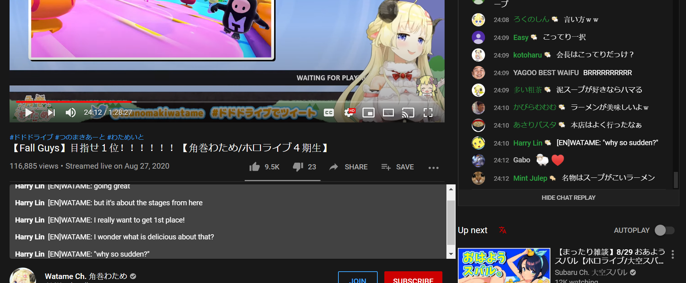
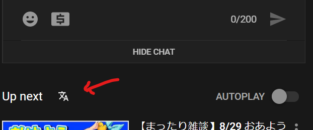

# Live Translate Userscript

This script shows a filtered view of messages from the youtube live chat. You
can still view the full chat in it's usual place.

It is intended to be used for Hololive live streams where some users post live
translation in the chat, usually marking their messages with [EN].

The default configuration detects these kind of messages:

- [EN]: Live translation
- [eng] Live translation
- [英訳/en]: Live translation
- Rushia: [EN] Live translation

Btw, this is how it looks.

This script was based on the one from u/konokalahola in
[this reddit post](https://www.reddit.com/r/Hololive/comments/ig9dxn/live_translation_extension_for_google_chrome/).

## Install

- Download [Tampermonkey](https://chrome.google.com/webstore/detail/tampermonkey/dhdgffkkebhmkfjojejmpbldmpobfkfo?hl=en) (Chrome) or [Greasemonkey](https://addons.mozilla.org/en-US/firefox/addon/greasemonkey/) (Firefox).
- Open [this link](https://github.com/kebien6020/live-translate-userscript/raw/master/dist/live-translate.user.js) to install the userscript.

You will find a new icon near "Up next" which will toggle the translation box.

## Main Features

- Automatically monitors the chat for new messages. And copies the messages that
  match into the translation box.
- Works for live chat and chat replay.
- Follows your configured light/dark theme.

## License

This proyect is licensed under the [WTFPL](http://www.wtfpl.net/). See the
[LICENSE.md](./LICENSE.md) file for more information.

## Changelog

### 1.0.1
- Follow light/dark theme of Youtube.

### 1.0.0
- Feature parity with original extension.
